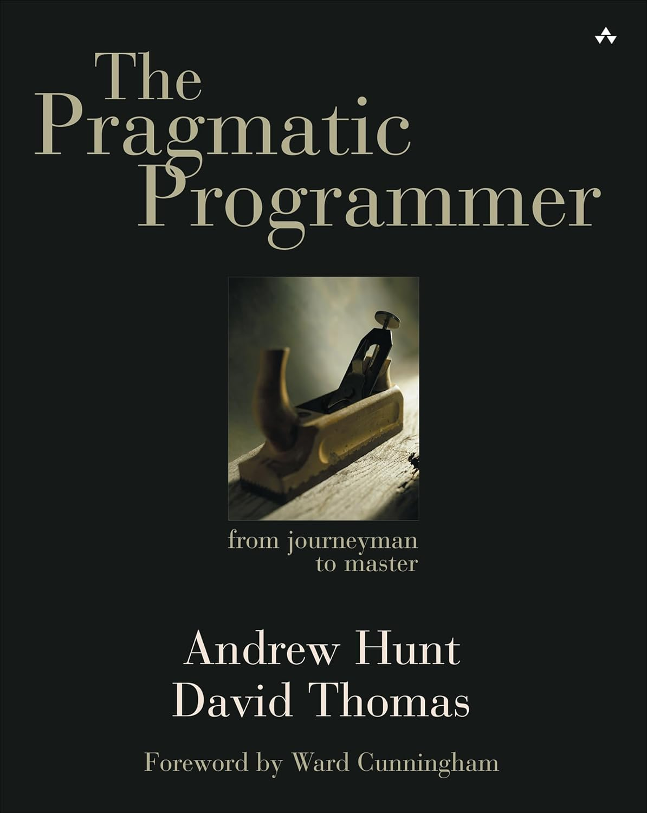

# Broken Windows and Tracer Bullets
## Over 25 Years of Pragmatic Wisdom

Gary Ray
Director of Sofware Engineering - CaseWorthy
https://github.com/geekcyclist/prag-prog-talk

<!--
Pleasure to be here - appreciate everyone sharing time

Recently saw a sticker that I bought several copies of
-->
---
## Be patient with me, I'm from the 1900's
 <!-- 
    - Transitioned from professional economist to professional software developer in 1998
    As my career started:
    - Yahoo! was the undisputed leader in web search, with AltaVista being popular with academics and researchers
        - instead of buying google for $1M, contracted for search results
    - dot.coms burning through VC cash and dropping millions on superbowl ads
    - Leading up to and coming out of the Y2K code crunch, concerned voices started talking about a bubble
    - dot-com market peaked on March, 10th, 2000. 
 -->

---

<a title="Jacob Bøtter from Copenhagen, Denmark, CC BY 2.0 &lt;https://creativecommons.org/licenses/by/2.0&gt;, via Wikimedia Commons" href="https://commons.wikimedia.org/wiki/File:Pets.com_sockpuppet.jpg"></a>

 <!-- 
    - By November the market had completely colapsed and the Pets.com sock puppet hit the
    - Even Amazon stock fell from $107 to $7
    -Through the late 90s
        - explosion of new projects taking advantage of web and distributed computing
        - hundreds of ground-up re-write projects
        - migrations of millions of lines of mainframe code
 -->

---

## Software Development Methodologies
### Heavyweight/Waterfall --> Lightweight/Iterative
* Crystal Clear: A Human‑Powered Methodology for Small Teams (Alistair Cockburn, 1997)
* SCRUM Development Process (Ken Schwaber, 1997)
* Extreme Programming Explained (Kent Beck, 1999)

<!--

- 1995 Standish Group Report that only 16.2% of software projects were successful
DESPITE (and maybe because of) heavyweight waterfall projects attempting to map requirements in detail 

People and books

Agile manifesto - Feb 2001
--> 

---

## The Pragmatic Programmer (1999)

<a title="The Pragmatic Programmer - Cover" href=".jpg"></a>

<!--
Dave Thomas & Andy Hunt - October 1999
Unlike the other books listed, it was not presented as a systemic methodology, but as a series of tips and techniques for developers.
Original book had 70 tips distributed across 8 chapters

Software development business has been through several cycles since 1999
and in 2019 the authors released an updated 20th Anniversary added an additional chapter and distributed 30 new tips across the book

Of those 100 - I'm going to highlight a few that are my favorites. I think all of these were part
of the original 70 tips - though some content in the book around those tips got heavy revision.

Not promise that these will be new to any of you - hope this talk is a reminder to "care about your craft"

Our context is going to be 5 key questions I hear asked over and over, and how these tips relate.
First...
-->

---

## "Why does our codebase feel like a minefield?"

* __Don't Live with Broken Windows (Tip #5, p.7)__\
    Fix bad designs, wrong decisions, and poor code when you see them.
* __Refactor Early, Refactor Often (Tip #65, p.212)__\
    Just as you might weed and rearrange a garden, rewrite, rework, and re-architect code when it needs it. Fix the root of the problem.

<!-- 
    - error popups ux close ignore
    - console errors
    - build warnings and linter recs unheaded

    Origin story
    - Ignore = Accept as the new standard
    - Fragile systems - every change results to a new bug or unexpected behavior somewhere else
-->

---

## "Why do we keep rewriting the same thing?"

* __Eliminate Effects Between Unrelated Things (Tip #17, p.40)__\
    Design components that are self-contained, independent, and have a single well-defined purpose.

* __DRY — Don't Repeat Yourself (Tip #15, p.31)__\
    Every piece of knowledge must have a single, unambiguous, authoritative representation within a system.

<!--
- Design for Orthogonality
    Advantages:
    - Localized changes
    - promotes reuse
    - reduces risk - problems tend to be isolated
    SUBTLE:combinatorics example M & N = MxN combos
    or - overlap, intersection reduces, or even worse, confounds expectations if there are diffs in the overlap

- DRY — Much more than just avoiding copy/paste code - it's about the duplication of knowledge and intent
    smell - needing to make a change in multiple places or in multiple ways
    NOTE: identical implementations may reflect different knowledge
-->

---
## "Why do we keep rewriting the same thing?"

Pseudocode:

```python
def validate_age(value)
    validate_type(value, :integer)
    validate_min_integer(value, 0)
```

```python
def validate_quantity(value)
    validate_type(value, :integer)
    validate_min_integer(value, 0)
```
<sup><sub>The Pragmatic Programmer, p.34</sub></sup>
<!-- Both function bodies are the same, and tools like SonarQube may flag this as duplication 
    BUT - they represent fundamentally different knowledge
-->
---

## "Why do we keep rewriting the same thing?"

Pseudocode:

```python
def validate_age(value)
    validate_type(value, :integer)
    validate_range(value, 18, 100)
```

```python
def validate_quantity(value)
    validate_type(value, :integer)
    validate_range(value, 1, 500)
```
<!-- 
But it's not just code, its
Every piece of knowledge must have a single, unambiguous, authoritative representation within a system.
Your team is a system

design, architectural/organizational decisions, documentation
-->

---
## "Why do we keep rewriting the same thing?"

"There are a finite number of keystrokes left in your hands before you die."
_Scott Hanselman_

<!--
- DRY — 
    Hanselman - limited keystrokes
    System story - as data moves, identifiers are changed. 7th meeting -> Confluence page
    Blog, Wiki's, Forums

But you know, worse than rewriting the same thing, is building the wrong thing...
-->

---

## "Why did we build the wrong thing?"
* __Prototype to Learn (Tip #21, p.57)__\
    The value of prototyping lies not in the code you produce, but in the lessons you learn.
* __Use Tracer Bullets (Tip #20, p.51)__\
    Tracer bullets let you Home in on your target by trying things and seeing how close they land.

<!-- 
few things are as demoralizing a pooring months into a feature that never gets used
or even makes the user experience worse.

- Both of these tips are about increasing the speed of your feedback loops.
- Prototype - INTENDED TO BE DISCARDED!!!
- Tracer - very small increments in front of your target audience as fast as possible
- AI can help with both of these, BUT, be wary of losing the benefits. It's about the LEARNING, not the code generation.
-->
---

## "Why does nothing ever get fixed around here?"

* __Provide Options, Don't Make Lame Excuses (Tip #4, p.4)__\
    Instead of excuses, provide options. Don't say it can't be done; explain what can be done.
* __Good Design Is Easier to Change Than Bad Design (Tip #14, p28)__\
    A thing is well designed if it adapts to the people who use it. For code, that means it must adapt by changing.

<!--
Moving up the career ladder - decision maker with wider influence
- Options: Don't be a blocker, only worse than a blocker is a complainer
- Bring options to the table
In "Behind Closed Doors: Secrets of Great Managmement" Esther Derby and Johanna Rothman point out
"Two options is a trap" You feel constraind by the either/or - but 3 options leads to 4.

- Well considered design options and incremental work lead to evolutionary architectures
- points back to Orthogonality - and DRY

- Again - teams are systems - Whether doing Scrum, XP, Kanban, Lean or something else
    It's not a question of which process is best, but adapting the process to the team.
    - Measure outcomes (working features)
    - Do Retros
-->

---
## "Why am I stuck in my career?"

* __Care About Your Craft (Tip #1, p.xxi)__\
    Why spend your life developing software unless you care about doing it well?
* __Invest Regularly in Your Knowledge Portfolio (Tip #9, p.15)__\
    Make learning a habit.
<!--
Have you had 5 years of experience, since this decade began, or have you had 1 year of experience 5 times?

You are responsible for your own career growth, not your boss, not your company, not your team. You!

Being here demonstrates you care
Software dev is not a science, it's not a licensable disciplne like civil engineering, 
and I don't believe it is best described as an art, because Art is desiged to elicit ane emotional response.
It is truly a CRAFT - like fine furniture making, design and build with the intent to be Functional

And if you care about your craft...you will invest in your knowledge portfolio.
-->
---
## Building your Portfolio

* __Invest Regularly__
* __Diversify__
* __Manage Risk__
* __Buy Low, Sell High__
* __Review and Rebalance__

<!--
- Invest - make learning a habit - book a month, new language each year
- Diversify - the more different things you know, the more valuable you are. Hard and soft skills
- Manage Risk - don't bet the farm on one new shiny thing, but even currently stable tech will age out.
- Buy low - Very hard, as those who bet on Cold Fusion, or Flash, or Silverlight have learned 
- Review and rebalance - revist tech you may have skimmed or even discarded
-->
---
## Top 3 Programming Languages
### 1970 - 2025 

    1970: Fortran, Assembly, COBOL
    1980: Pascal, Fortan, BASIC
    1990: C, Pascal, Ada
    2000: C, Java, Javascript
    2010: Java, Javascript, PHP (C# 7th) 
    2020: Python, Java, Javascript (C# 4th)
    2025: Python, JavaScript, Java (C# 4th)

<sub><sup>Source: [Data is Beautiful](https://www.youtube.com/watch?v=ZTPrbAKmcdo)</sup></sub>

<!-- 
- Technology changes, languages and tech stacks come and go
- Build a habbit of learing so you don't fall behind
-->

---

## Honorable Mentions

* __Keep Knowledge in Plain Text__
* __Achieve Editor Fluency__
* __"select" Isn't Broken__
* __If It's Important Enough to be Global, Wrap it in an API__
* __Listen to Your Inner Lizard__
* __Coding Ain't Done 'till All The Tests Run__

<!-- 
 These are some of my other favorites, and I sometimes swap them in and out for other tips.
 - Plain text - these slides, markdown or auto gen documentation, csvs
 - AI pointed at a directory of plain text files - summarize, analyze, format
    - Read and add value
    - AI agents have skills to target binary formats like Word or Excel - but token usage...
-->

---

## Bibliography

The Pragmatic Programmer: From Journeyman to Master (Andy Hunt and Dave Thomas) (Obviously)
Behind Closed Doors: Secrets of Great Management (Esther Derby and Johanna Rothman)
Code Complete (Steve McConnell)

Send me your suggestions!

gary.ray@gmail.com

---
## Questions & Contact

github: https://github.com/geekcyclist/prag-prog-talk
email: gary.ray@gmail.com
X/Twitter: @geekcyclist
web: https://agilecoder.net (tech focus)
web: https:geekcyclist.com (personal, cycling, cooking, etc.)
